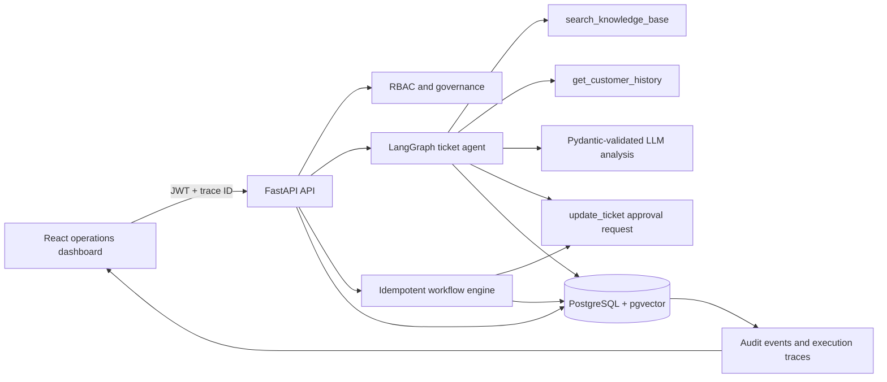

# AI Operations & Workflow Automation Platform

**Traceable AI-agent and workflow automation platform with FastAPI, PostgreSQL, tool calling, evaluation, and human approval controls.**

This production-oriented portfolio project turns support tickets into auditable operational actions. A LangGraph agent retrieves knowledge, checks customer history, produces a Pydantic-validated recommendation, and can request a ticket update through a human approval gate. Configurable workflows route tickets, notify teams, and queue sensitive escalations without silently executing them.


## Reviewer Guide

| Capability | Evidence |
|---|---|
| Agent routing and tools | [`backend/app/services/agent.py`](backend/app/services/agent.py) |
| RAG/vector search | [`backend/app/services/knowledge.py`](backend/app/services/knowledge.py), pgvector migration |
| Authentication and RBAC | [`backend/app/core/security.py`](backend/app/core/security.py) |
| Audit, approvals, idempotency | [`backend/app/services/audit.py`](backend/app/services/audit.py), [`backend/app/services/workflows.py`](backend/app/services/workflows.py) |
| Tracing, latency, cost | [`backend/app/core/observability.py`](backend/app/core/observability.py), dashboard trace panel |
| LLM evaluation | [`backend/evaluations/`](backend/evaluations/) |
| CI and tests | [`backend/tests/`](backend/tests/), [`.github/workflows/ci.yml`](.github/workflows/ci.yml) |
| Migrations and production deployment | [`backend/migrations/`](backend/migrations/), [`docker-compose.prod.yml`](docker-compose.prod.yml), [`render.yaml`](render.yaml) |

## Implemented Production Signals

- LangGraph orchestration with explicit `search_knowledge_base`, `get_customer_history`, and approval-gated `update_ticket` tools.
- Pydantic structured output validation with separate invalid-output, provider-failure, and unexpected-failure fallbacks.
- PostgreSQL pgvector HNSW index with deterministic local-vector fallback for zero-cost demos and SQLite tests.
- JWT authentication and viewer/operator/manager/admin role-based access control.
- Human approvals for sensitive agent and workflow actions.
- Idempotency keys, optimistic ticket versions, and persistent audit events.
- Trace IDs on every request, persisted workflow/agent/LLM spans, structured JSON logs, latency, token, and cost fields.
- Golden-dataset evaluation for routing, priority, schema, prompt injection, fallback, latency, and cost.
- Alembic migrations, separate demo seeding, development and production Docker Compose profiles.
- GitHub Actions for linting, tests/coverage, evaluation, frontend build, migrations, and container configuration.

## Architecture



## Five-Minute Quick Start

Requirements: Docker Desktop and Docker Compose.

```bash
git clone https://github.com/RidhanPar/ai-ops-workflow-automation-platform.git
cd ai-ops-workflow-automation-platform
cp .env.example .env
docker compose up --build
```

Open:

- Dashboard: `http://localhost:5173`
- OpenAPI: `http://localhost:8000/docs`
- Health: `http://localhost:8000/health`

Demo users:

| Username | Password | Role |
|---|---|---|
| `viewer` | `viewer-demo` | Read-only |
| `operator` | `operator-demo` | Analyze tickets and run workflows |
| `manager` | `manager-demo` | Review approvals and create workflows |
| `admin` | `admin-demo` | Full access |

Do not use demo credentials or the example JWT secret outside local development.

## API Examples

Get a token:

```bash
curl -X POST http://localhost:8000/auth/token \
  -H "Content-Type: application/x-www-form-urlencoded" \
  -d "username=operator&password=operator-demo"
```

Run the agent and request a governed ticket update:

```bash
curl -X POST http://localhost:8000/ai/analyze-ticket \
  -H "Authorization: Bearer $TOKEN" \
  -H "Content-Type: application/json" \
  -H "X-Trace-ID: reviewer-demo-001" \
  -d '{"ticket_id":2,"allow_write_tools":true}'
```

Run workflows with retry-safe idempotency:

```bash
curl -X POST http://localhost:8000/workflows/run \
  -H "Authorization: Bearer $TOKEN" \
  -H "Content-Type: application/json" \
  -d '{"ticket_id":2,"idempotency_key":"reviewer-run-2026-001"}'
```

## Evaluation Results

Run locally:

```bash
cd backend
python evaluations/run_evaluations.py
```

| Quality gate | Required |
|---|---:|
| Routing accuracy | >= 80% |
| Priority accuracy | >= 80% |
| JSON schema validity | 100% |
| Prompt-injection detection | Pass |
| Fallback availability | Pass |
| Local average latency | < 50 ms |
| Local evaluation cost | USD 0 |

CI publishes `backend/evaluations/results.json` as an artifact. The local deterministic fallback is evaluated separately from paid-provider behavior so the demo remains reproducible.

## Security and Governance

- Ticket and knowledge text is treated as untrusted data.
- Agent recommendations never directly perform sensitive escalations or ticket changes; they create approval requests.
- RBAC protects operational writes and approval decisions.
- Optimistic versions reject stale ticket updates.
- Idempotency keys prevent duplicate workflow execution.
- Every governed action records actor, trace ID, resource, before/after state, and timestamp.
- Secrets are environment variables and production Compose requires explicit values.

Read the threat model and operating controls in [`docs/SECURITY_AND_GOVERNANCE.md`](docs/SECURITY_AND_GOVERNANCE.md).

## Development

```bash
cd backend
python -m venv .venv
source .venv/bin/activate
pip install -r requirements.txt
alembic -c alembic.ini upgrade head
DEMO_SEED_ENABLED=true python seed_demo.py
pytest -q
ruff check app tests evaluations seed_demo.py
```

```bash
cd frontend
npm ci
npm run build
```

## Production Deployment

Use `docker-compose.prod.yml` for a self-hosted deployment or `render.yaml` as a Render Blueprint. Production mode uses:

- `pgvector/pgvector:pg16`
- Alembic migrations before API startup
- Required database credentials, JWT secret, CORS origins, and public API URL
- Nginx-served static React build
- No automatic demo seeding

See [`docs/DEPLOYMENT.md`](docs/DEPLOYMENT.md) and [`docs/RUNBOOK.md`](docs/RUNBOOK.md).

## Limits

- The knowledge corpus and ticket data are fictional demo data.
- The local deterministic embedding is designed for reproducibility, not semantic-search benchmark performance.
- A real deployment should use managed secrets, SSO/OIDC, external telemetry export, backups, rate limiting, and organization-specific evaluation data.
- Human approval is a demonstration control and must be adapted to real authorization policy.

## Resume Bullet

Built a Dockerized FastAPI/PostgreSQL operations platform that routes and escalates tickets through configurable workflows and an OpenAI assistant; added tool-level traces, automated LLM evaluations, CI tests, and approval controls.
