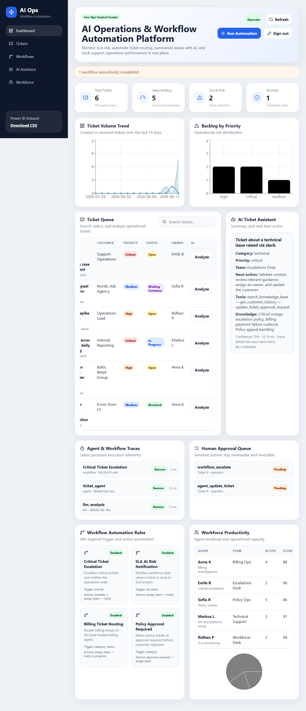
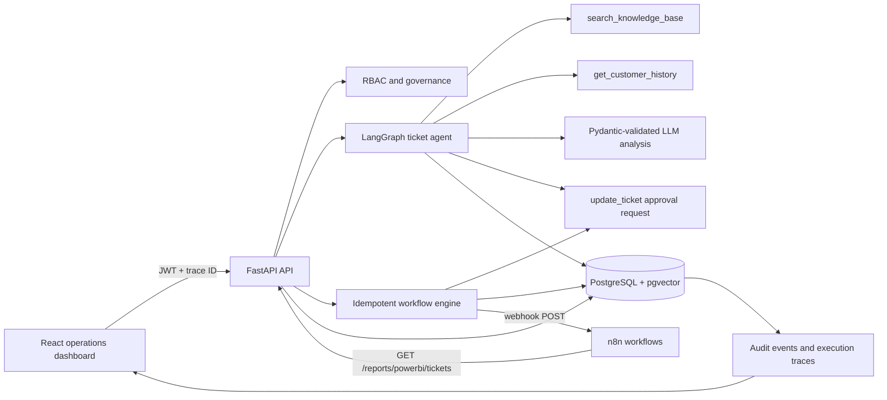

# AI Operations & Workflow Automation Platform

**Traceable AI-agent and workflow automation platform with FastAPI, PostgreSQL, tool orchestration, evaluation, and human approval controls.**

This production-oriented portfolio project turns support tickets into auditable operational actions. A LangGraph agent retrieves knowledge, checks customer history, produces a Pydantic-validated recommendation, and can request a ticket update through a human approval gate. Configurable workflows route tickets, notify teams, and queue sensitive escalations without silently executing them.

[Live dashboard](https://ridhan-ai-ops-dashboard.onrender.com) · [API documentation](https://ridhan-ai-ops-api.onrender.com/docs) · [API health](https://ridhan-ai-ops-api.onrender.com/health)



## Reviewer Guide

| Capability | Evidence |
|---|---|
| LangGraph agent and explicit tools | [`backend/app/services/agent.py`](backend/app/services/agent.py) |
| RAG/vector search | [`backend/app/services/knowledge.py`](backend/app/services/knowledge.py), pgvector migration |
| Authentication and RBAC | [`backend/app/core/security.py`](backend/app/core/security.py) |
| Audit, approvals, idempotency | [`backend/app/services/audit.py`](backend/app/services/audit.py), [`backend/app/services/workflows.py`](backend/app/services/workflows.py) |
| Tracing, latency, cost | [`backend/app/core/observability.py`](backend/app/core/observability.py), dashboard trace panel |
| LLM evaluation | [`backend/evaluations/`](backend/evaluations/) |
| CI and tests | [`backend/tests/`](backend/tests/), [`.github/workflows/ci.yml`](.github/workflows/ci.yml) |
| Migrations and production deployment | [`backend/migrations/`](backend/migrations/), [`docker-compose.prod.yml`](docker-compose.prod.yml), [`render.yaml`](render.yaml) |
| n8n workflow integration | [`n8n/`](n8n/) |
| Prometheus metrics and Grafana dashboard | [`monitoring/`](monitoring/), [`docker-compose.monitoring.yml`](docker-compose.monitoring.yml) |
| Kubernetes manifests and autoscaling | [`k8s/`](k8s/), [`.github/workflows/k8s-validate.yml`](.github/workflows/k8s-validate.yml) |

## Implemented Production Signals

- LangGraph orchestration with explicit `search_knowledge_base`, `get_customer_history`, and approval-gated update-request tools.
- Pydantic structured output validation with separate invalid-output, provider-failure, and unexpected-failure fallbacks.
- PostgreSQL pgvector HNSW index with deterministic local-vector fallback for zero-cost demos and SQLite tests.
- JWT authentication and viewer/operator/manager/admin role-based access control.
- Human approvals for sensitive agent and workflow actions.
- Idempotency keys, optimistic ticket versions, and persistent audit events.
- Trace IDs on every request, persisted workflow/agent/LLM spans, structured JSON logs, latency, token, and cost fields.
- Golden-dataset evaluation for routing, priority, schema, prompt injection, fallback, latency, and cost.
- Alembic migrations, separate demo seeding, development and production Docker Compose profiles.
- GitHub Actions for linting, tests/coverage, evaluation, frontend build, migrations, and container configuration.
- n8n webhook and scheduled workflows with branching logic connected to the backend API.

## Architecture



## Five-Minute Quick Start

Requirements: Docker Desktop and Docker Compose.

```bash
git clone https://github.com/RidhanPar/ai-ops-workflow-automation-platform.git
cd ai-ops-workflow-automation-platform
cp .env.example .env
docker compose up --build
```

Open:

- Dashboard: `http://localhost:5173`
- OpenAPI: `http://localhost:8000/docs`
- Health: `http://localhost:8000/health`

Demo users:

| Username | Password | Role |
|---|---|---|
| `viewer` | `viewer-demo` | Read-only |
| `operator` | `operator-demo` | Analyze tickets and run workflows |
| `manager` | `manager-demo` | Review approvals and create workflows |
| `admin` | `admin-demo` | Full access |

Do not use demo credentials or the example JWT secret outside local development.

## n8n Workflow Automation

The `n8n/` directory contains two real n8n workflows that connect to the backend, exported as importable JSON, plus a Docker Compose file to run n8n locally.

### What is included

| File | Description |
|---|---|
| `n8n/workflows/workflow_a_ticket_event_handler.json` | Webhook-triggered workflow that routes ticket events by priority |
| `n8n/workflows/workflow_b_scheduled_report_digest.json` | Daily scheduled workflow that fetches and summarizes the ticket report |
| `n8n/docker-compose.n8n.yml` | Runs the official n8n Docker image joined to the backend network |
| `n8n/SETUP.md` | Full setup guide with import steps and test commands |

### Workflow A - Ticket Event Handler

Triggered by a POST to the n8n webhook endpoint at `/webhook/ticket-event`. Expects a JSON body with `ticket_id`, `priority`, `category`, and `customer`.

An IF node branches on the `priority` field:

- **high or critical**: posts an `alert_level: URGENT` payload to a mock notification endpoint (webhook.site)
- **low or medium**: posts a `log_level: INFO` payload to the same mock endpoint for queue logging

```
[Webhook POST /ticket-event]
        |
[Priority Router - IF node]
     /        \
(high/crit)  (low/med)
     |              |
[Notify endpoint] [Log endpoint]
```

This workflow is the n8n equivalent of the backend rule-based `notify` action in `services/workflows.py`. You can POST to the n8n webhook URL directly from curl or from a custom notify action in the backend.

### Workflow B - Scheduled Report Digest

Runs daily at 08:00 UTC via cron trigger `0 8 * * *`.

1. Calls `GET http://aiops_backend:8000/reports/powerbi/tickets` (the same endpoint used by Power BI)
2. Aggregates the response in a JavaScript Code node: total tickets, open count, escalated count, SLA breach count, breakdown by priority / status / category, and an alert message
3. Posts the full digest JSON to the mock endpoint with header `X-Report-Source: aiops-n8n-digest`

```
[Schedule - daily 08:00 UTC]
        |
[GET /reports/powerbi/tickets]
        |
[Build Digest Summary - Code node]
        |
[POST digest to mock endpoint]
```

### Quick start for n8n

1. Start the main platform stack: `docker compose up -d`
2. Replace `YOUR_UNIQUE_ID_HERE` in both workflow JSON files with a URL from https://webhook.site
3. Start n8n: `docker compose -f n8n/docker-compose.n8n.yml up -d`
4. Open http://localhost:5678, create an owner account, import both workflow files, and activate them

See `n8n/SETUP.md` for detailed instructions and test commands.

## Observability

The platform exposes a Prometheus `/metrics` endpoint and ships a pre-built Grafana dashboard covering the four signals that matter most for an AI operations backend.

### Metrics

| Metric | Type | Labels | Description |
|---|---|---|---|
| `http_requests_total` | Counter | method, handler, status_code | All HTTP requests (via prometheus-fastapi-instrumentator) |
| `http_request_duration_seconds` | Histogram | method, handler | HTTP request latency with p50/p95 breakdowns |
| `agentic_requests_total` | Counter | source | Total LangGraph agent invocations by analysis path |
| `llm_call_latency_seconds` | Histogram | source | Per-LLM-call latency in seconds |
| `llm_tokens_used_total` | Counter | direction (input/output) | Cumulative token consumption |
| `human_approval_gates_triggered_total` | Counter | action_type | Agent and workflow approval gate triggers |

### Dashboard panels


The pre-built Grafana dashboard (`monitoring/grafana-dashboard.json`) contains five panels:

1. **HTTP Request Rate** - `rate(http_requests_total[5m])` grouped by method and handler
2. **HTTP Latency p95 and p50** - `histogram_quantile` over `http_request_duration_seconds`
3. **LLM Token Usage Rate** - stacked input/output token throughput per second
4. **Approval Gate Triggers** - bar chart of `human_approval_gates_triggered_total` by action type
5. **Cumulative Totals** - stat panel showing lifetime agent invocations, approval gates, and token totals

### Spin up the monitoring stack

Start the main platform first, then:

```bash
docker compose -f docker-compose.monitoring.yml up -d
```

Open:

- Prometheus: `http://localhost:9090`
- Grafana: `http://localhost:3001` (login: admin / admin)

The Prometheus datasource and the AI Ops dashboard are provisioned automatically on first start. No manual import needed.

To verify metrics are being collected:

```bash
curl http://localhost:8000/metrics | grep agentic_requests_total
```

To stop the monitoring stack:

```bash
docker compose -f docker-compose.monitoring.yml down
```

## API Examples

Get a token:

```bash
curl -X POST http://localhost:8000/auth/token \
  -H "Content-Type: application/x-www-form-urlencoded" \
  -d "username=operator&password=operator-demo"
```

Run the agent and request a governed ticket update:

```bash
curl -X POST http://localhost:8000/ai/analyze-ticket \
  -H "Authorization: Bearer $TOKEN" \
  -H "Content-Type: application/json" \
  -H "X-Trace-ID: reviewer-demo-001" \
  -d '{"ticket_id":2,"allow_write_tools":true}'
```

Run workflows with retry-safe idempotency:

```bash
curl -X POST http://localhost:8000/workflows/run \
  -H "Authorization: Bearer $TOKEN" \
  -H "Content-Type: application/json" \
  -d '{"ticket_id":2,"idempotency_key":"reviewer-run-2026-001"}'
```

## Evaluation Results

Run locally:

```bash
cd backend
python evaluations/run_evaluations.py
```

| Quality gate | Required |
|---|---:|
| Routing accuracy | >= 80% |
| Priority accuracy | >= 80% |
| JSON schema validity | 100% |
| Prompt-injection detection | Pass |
| Fallback availability | Pass |
| Local average latency | < 50 ms |
| Local evaluation cost | USD 0 |

CI publishes `backend/evaluations/results.json` as an artifact. The local deterministic fallback is evaluated separately from paid-provider behavior so the demo remains reproducible.

## Security and Governance

- Ticket and knowledge text is treated as untrusted data.
- Agent recommendations never directly perform sensitive escalations or ticket changes; they create approval requests.
- RBAC protects operational writes and approval decisions.
- Optimistic versions reject stale ticket updates.
- Idempotency keys prevent duplicate workflow execution.
- Every governed action records actor, trace ID, resource, before/after state, and timestamp.
- Secrets are environment variables and production Compose requires explicit values.

Read the threat model and operating controls in [`docs/SECURITY_AND_GOVERNANCE.md`](docs/SECURITY_AND_GOVERNANCE.md).

## Kubernetes Deployment

The [`k8s/`](k8s/) directory contains production-grade manifests for deploying to any Kubernetes cluster (tested syntax with --dry-run=client on kubectl v1.30).

Architecture: 2-10 API pods (auto-scaled by HPA) + 1 PostgreSQL StatefulSet with 10Gi persistent volume + ClusterIP Services + nginx Ingress with TLS.

| Component | Kind | Replicas | Auto-scale |
|---|---|---|---|
| API | Deployment | 3 | Yes (HPA 2-10, CPU 70%, memory 80%) |
| PostgreSQL | StatefulSet | 1 | No (stateful) |
| Ingress | Ingress | -- | nginx + TLS via cert-manager |

### Deploy

```bash
# 1. Set secrets (replace placeholders with base64-encoded values)
kubectl apply -f k8s/namespace.yaml
kubectl apply -f k8s/secret.yaml      # edit first
kubectl apply -f k8s/configmap.yaml

# 2. Deploy database first
kubectl apply -f k8s/postgres-statefulset.yaml
kubectl apply -f k8s/postgres-service.yaml
kubectl wait --for=condition=ready pod -l app=postgres -n ai-ops --timeout=120s

# 3. Deploy API
kubectl apply -f k8s/api-deployment.yaml
kubectl apply -f k8s/api-service.yaml
kubectl apply -f k8s/hpa.yaml
kubectl apply -f k8s/ingress.yaml
```

### Verify

```bash
kubectl get pods -n ai-ops
kubectl get hpa -n ai-ops
kubectl describe ingress -n ai-ops
```

Manifest YAML is validated on every push to `k8s/**` via the [`k8s-validate`](.github/workflows/k8s-validate.yml) GitHub Actions workflow using `kubectl apply --dry-run=client`.

## Development

```bash
cd backend
python -m venv .venv
source .venv/bin/activate
pip install -r requirements.txt
alembic -c alembic.ini upgrade head
DEMO_SEED_ENABLED=true python seed_demo.py
pytest -q
ruff check app tests evaluations seed_demo.py
```

```bash
cd frontend
npm ci
npm run build
```

## Production Deployment

Use `docker-compose.prod.yml` for a self-hosted deployment or `render.yaml` as a Render Blueprint. Production mode uses:

- `pgvector/pgvector:pg16`
- Alembic migrations before API startup
- Required database credentials, JWT secret, CORS origins, and public API URL
- Nginx-served static React build
- No automatic demo seeding

See [`docs/DEPLOYMENT.md`](docs/DEPLOYMENT.md) and [`docs/RUNBOOK.md`](docs/RUNBOOK.md).

## Limits

- The knowledge corpus and ticket data are fictional demo data.
- The local deterministic embedding is designed for reproducibility, not semantic-search benchmark performance.
- A real deployment should use managed secrets, SSO/OIDC, external telemetry export, backups, rate limiting, and organization-specific evaluation data.
- Human approval is a demonstration control and must be adapted to real authorization policy.

## Resume Bullet

Built a Dockerized FastAPI/PostgreSQL operations platform that routes and escalates tickets through configurable workflows and an optional OpenAI assistant; added LangGraph tool orchestration, automated evaluations, trace evidence, CI tests, and approval controls.
